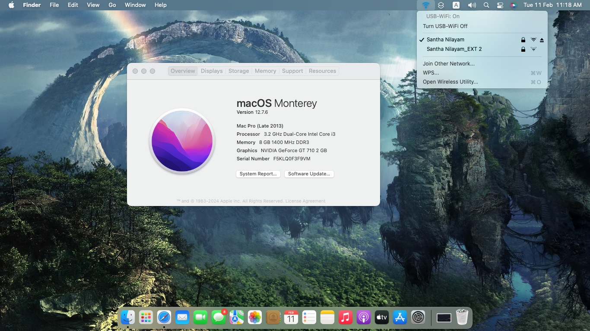

# Hackintosh EFI – Intel i3-3210 & GT 710 (Monterey)
💻 OpenCore EFI for running **macOS Monterey** on an **Intel i3-3210 & GT 710** system.  

> 🚧 **Work in Progress** – This guide is still being updated as testing progresses.

---

## Project Status

### Screenshot 📸  

| **macOS Version** | **Status** |
|------------------|-----------|
| macOS Monterey (`12.x`) | ✅ Stable |

---

## Hardware Compatibility
This EFI is designed for the following configuration:  

### System Specifications
| **Component** | **Details** |
|-------------|------------|
| **Motherboard** | ASUS P8H61-M LX R2.0 |
| **CPU** | Intel Core i3-3210 (Ivy Bridge) |
| **GPU** | NVIDIA GeForce GT 710 (Kepler) |
| **RAM** | 8GB DDR3 1333MHz |
| **Storage** | SATA SSD/HDD |
| **Wi-Fi & Bluetooth** | Realtek USB Wi-Fi Adapter *(requires manual driver installation, see below)* |
| **Audio** | Realtek ALC887 |
| **SMBIOS** | MacPro6,1 |

---

### **ACPI Patches & SSDTs**
The following **SSDTs** are used for proper ACPI patching:  

| **SSDT** | **Purpose** | **Details** |
|---------|------------|------------|
| **SSDT-EC** | Emulated Embedded Controller | Required for Ivy Bridge platforms |
| **SSDT-PM** | CPU Power Management | Generated using [`ssdtPRGen.sh`](https://github.com/Piker-Alpha/ssdtPRGen.sh) *(Post-Install Step)* |
| **SSDT-IEMI** | Fixes I2C/I2C HID issues | Helps with device communication |
| **SSDT-SBUS** | Enables SMBus functionality | Improves system stability |

These SSDTs are pre-configured in the `EFI/OC/ACPI` folder.

---

## Limitations ⚠️
- ❌ **No Metal Support** – GT 710 is Kepler-based but lacks full Metal acceleration in macOS Monterey.
- ❌ **No AirDrop & Continuity** – Requires a native macOS-supported Wi-Fi/Bluetooth adapter.
- ⚠️ **Requires SMBIOS Tweaks** – Ensure proper configuration for iMessage, App Store, and FaceTime.

---

## What Works ✅
- ✅ **Graphics Acceleration (via OCLP)**
- ✅ **Audio (ALC887 with AppleALC)**
- ✅ **USB (Properly mapped)**
- ✅ **Ethernet (Realtek RTL8111)**
- ✅ **Sleep/Wake**
- ✅ **Basic macOS Functionality**
- ✅ **Wi-Fi (via third-party driver, see below)**

---

## Known Issues 🚨
- ❌ **No native Wi-Fi & Bluetooth**
- ❌ **No DRM support for Apple TV+ and Netflix in Safari**
- ❌ **Might require boot args tuning for stability**

---

## Fixing Realtek USB Wi-Fi Adapters
If you are using a **Realtek USB Wi-Fi Adapter**, you need to install a third-party driver **after installing macOS**:

➡️ **[Download the Realtek USB Wi-Fi Driver](https://github.com/chris1111/Wireless-USB-Big-Sur-Adapter)**  
Follow the installation instructions provided on the GitHub page to enable Wi-Fi functionality.

---

### **☕ Support Me on Ko-fi**

---

## Credits 🙌
- [Acidanthera](https://github.com/acidanthera) for OpenCore, Lilu, AppleALC, WhateverGreen.
- [Dortania’s OpenCore Guide](https://dortania.github.io/OpenCore-Install-Guide/) for documentation.
- [Chris1111](https://github.com/chris1111/Wireless-USB-Big-Sur-Adapter) for Realtek Wi-Fi drivers.
- Hackintosh communities for testing and feedback.

---

### 📜 Disclaimer  
⚠️ **This EFI is provided as-is.** I am not responsible for any issues that may arise from using this setup. Proceed at your own risk.
